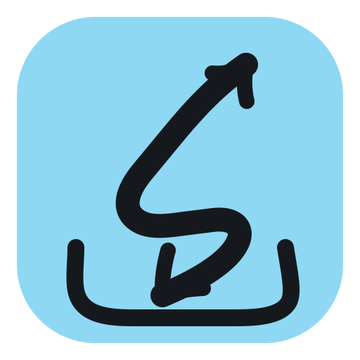
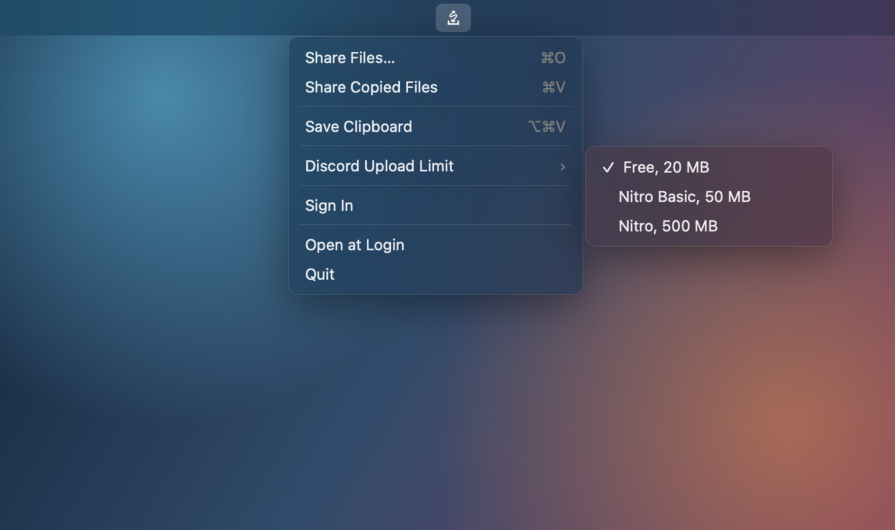

<h1 align="center">Sago Drop</h1>
<div align="center">

  

  <br />

  Fit Mac screen recordings into Discord when quality allows, or turn them into links when it doesn't.

  

  <a href="https://github.com/sago-cream/sago-drop/releases/latest">Download latest release</a>
   ·
  <a href="#install">Install with Homebrew</a>
</div>

## Why

Discord rejects videos once they get too large. Drop a recording on Sago Drop's
menu-bar icon and it picks the better route. Files that fit without dropping
below 720p stay local and are copied for direct attachment. Larger recordings
are uploaded and copied as share links.

Sago Drop also uploads images and other videos when you want the same quick
drop-to-link workflow.

- **Drop, paste, or choose:** Share directly from the menu bar without opening
  a full app window, or turn clipboard content into a file in Downloads.
- **Made for Apple recordings:** Keep compatible files unchanged or compress
  MOV and MP4 video locally to a 1080p or 720p H.264 MP4.
- **Ready to paste:** The clipboard receives either a Discord attachment or a
  public link.
- **Native and local where it matters:** The app is signed and notarized, video
  processing stays on the Mac, and its device credential lives in Keychain.

## Install

Install with Homebrew:

```bash
brew install --cask sago-cream/tap/sago-drop
```

Or download the latest signed and notarized app from
[GitHub Releases](https://github.com/sago-cream/sago-drop/releases/latest).

Requirements:

- macOS 14 Sonoma or newer
- Access approved by the Sago Media administrator for link uploads

## First Run

1. Open Sago Drop from Applications. It appears in the menu bar instead of the
   Dock.
2. To enable link fallback, choose **Sign In** from its menu.
3. Approve the displayed request in your browser.

Link uploads work once access is approved. Direct Discord attachments do not
require a Sago Media account. The credential is saved in Keychain, so signing
in is normally a one-time step.

Choose **Open at Login** from the menu if you want Sago Drop to start when you
log in to your Mac.

## Share

- Drag supported files directly onto the menu-bar icon.
- Copy a file in Finder and choose **Share Copied Files** (`⌘V`).
- Copy other content and choose **Save Clipboard** (`⌥⌘V`) to save it as a
  file in Downloads.
- Choose **Share Files…** (`⌘O`) to use the standard file picker.

Set **Discord Upload Limit** to Free, Nitro Basic, or Nitro. A single file that
already fits is copied unchanged. Oversized video is compressed only when it
can remain at 1080p or 720p. Everything else uses Sago Media. Multiple files
continue through Sago Media.

The menu-bar icon shows conversion and upload progress. The five latest link
uploads remain available under **Recent Uploads**.

## Formats and Limits

- Direct Discord attachments use the selected 20 MB, 50 MB, or 500 MB limit.
- Local video compression targets H.264/AAC MP4 and never drops below 720p.
- Videos routed to Sago Media are normalized locally to 1080p H.264/AAC MP4
  and targeted below 80 MB before upload.
- Other supported files must already be under 90 MB.
- Supported formats: PNG, JPEG, GIF, WebP, MOV, and MP4.

## Privacy

- The device credential is stored in macOS Keychain.
- Video processing happens locally on the Mac.
- Prepared Discord attachments remain in the app cache so they are still
  available when pasted. Sago Drop removes entries older than one day when it
  launches or prepares another attachment.
- Files are uploaded to `media.hsichen.dev` and receive a public share URL.
- Sago Drop has no analytics or background file scanning.

## Troubleshooting

- **Sharing asks you to sign in:** The file could not fit the selected Discord
  limit without dropping below 720p. Sign in to upload it as a link.
- **A file is rejected:** Check its format and the limits above. MOV and MP4
  files are prepared locally; images must fit the upload limit already.
- **Homebrew installed an older version:** Run `brew update`, then
  `brew upgrade --cask sago-cream/tap/sago-drop`.
- **Two menu-bar icons appear:** Quit either the development build or the
  installed app so only one copy remains open.

## Development

Run directly from the source tree:

```bash
swift run
```

Build and launch a local app bundle:

```bash
scripts/build-app
open ".build/Sago Drop.app"
```

Run the agent-safe upload progress smoke suite:

```bash
scripts/smoke-upload-progress
```

The suite uses a throttled localhost server and debug-only credentials to test
successful and failed uploads without reading Keychain or creating public media.

Generate matched menu screenshots for visual review:

```bash
scripts/menu-mockups
```

## Maintainer Release

`scripts/package-app <version>` builds the hardened-runtime app, signs it with
the configured Developer ID Application certificate, notarizes it when
`SAGO_DROP_NOTARY_PROFILE` is set, verifies the exact archived app, and creates
the Homebrew cask in `dist/`.

Release from a clean `main` that exactly matches `origin/main`:

```bash
scripts/release <version> "<user-facing change>"
```

The release script uses the existing `Sago Media` notarytool Keychain profile
by default (override it with `SAGO_DROP_NOTARY_PROFILE`), publishes the ZIP and
cask without changing `main`, then updates `sago-cream/homebrew-tap` using the
current GitHub CLI login. If only the tap update needs to be retried, run
`scripts/update-homebrew <version>`.

## License

[MIT](LICENSE)
